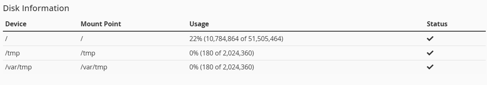
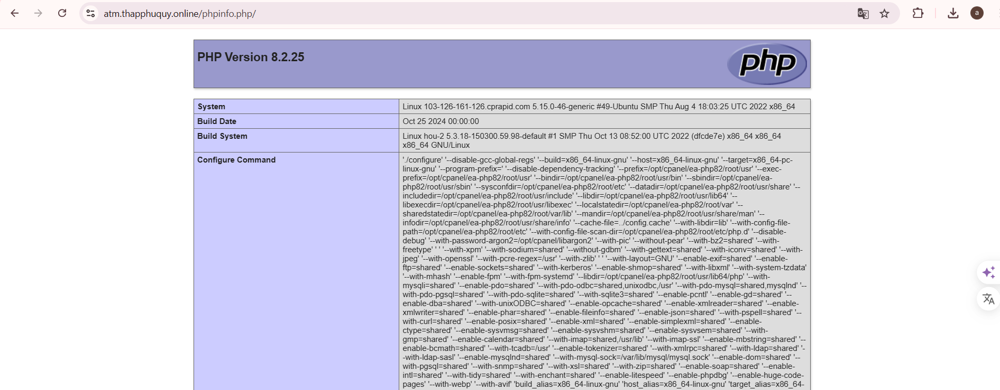
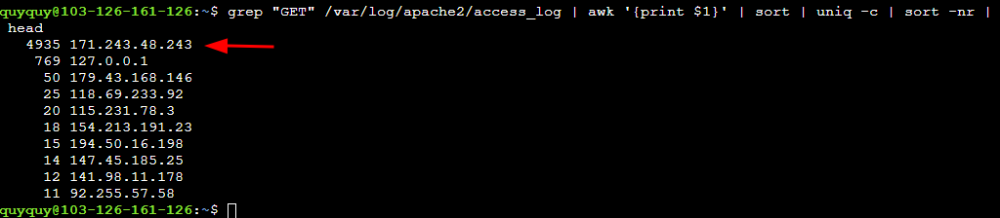

## So sánh tính năng Cpanel nguyên bản vs Cpanel + Cloudlinux trên Hosting
### Tổng quan 

| Phân loại           | cPanel nguyên bản                                                                                                         | cPanel + CloudLinux                                                                                           |
|---------------------|---------------------------------------------------------------------------------------------------------------------------|---------------------------------------------------------------------------------------------------------------|
| **Định nghĩa**      | cPanel là hệ thống quản trị web phổ biến, với giao diện đồ họa dễ dùng, cung cấp nhiều tính năng quản lý hosting cho người dùng và quản trị viên | CloudLinux là hệ điều hành máy chủ web dựa trên CentOS/RHEL, được thiết kế cho nhà cung cấp dịch vụ hosting, hỗ trợ khả năng phân tách tài nguyên và bảo mật |
| **Tính năng chính** | Quản lý tập tin: FTP, file manager, images<br>Quản lý cơ sở dữ liệu: MySQL/MariaDB, PostgreSQL<br>Quản lý tên miền: Subdomain, Redirects<br>Hỗ trợ email: Tài khoản email, tự động trả lời<br>Thống kê và phân tích: Theo dõi lỗi, băng thông, lượng truy cập<br>Bảo mật: SSH, IP Blocker, chính sách bảo mật<br>Ứng dụng và cấu hình: Kiểm tra server, cấu hình PHP, tối ưu website<br>Cài đặt nâng cao: CRON jobs, MIME Types, kiểm tra DNS<br>Tùy chọn người dùng: Cấu hình giao diện, ngôn ngữ, liên lạc | Phân bổ tài nguyên riêng cho từng tài khoản: Nhờ công nghệ LVE, mỗi tài khoản có tài nguyên riêng.<br>Ổn định cao: Lưu lượng tăng đột biến của một tài khoản không ảnh hưởng đến các tài khoản khác.<br>Bảo mật với Hardened Kernel: Ngăn ngừa các tấn công từ tài khoản độc hại.<br>Nhiều phiên bản PHP: PHP Selector cho phép người dùng chọn phiên bản PHP phù hợp.<br>Quản lý MySQL ổn định: MySQL Governor giám sát và hạn chế tài khoản lạm dụng |
| **Ưu và nhược điểm** | **Ưu điểm:** Dễ dùng, ổn định, bảo mật tốt, hỗ trợ qua API, quản lý từ xa, sao lưu hiệu quả<br>**Nhược điểm:** Có nhiều tính năng phức tạp, dễ thay đổi nhầm thông số, chi phí cao | **Ưu điểm:** Ổn định, bảo mật cao, tối ưu máy chủ, tương thích tốt với cPanel.<br>**Nhược điểm:** Tốn kém thêm chi phí, khó học, phụ thuộc vào CloudLinux, giới hạn phân bổ tài nguyên |


### 1. Cài đặt cPanel & WHM Installer
Đầu tiên cần SSH vào VPS đang sử dụng: ssh root@103.126.161.126 

Và chạy lệnh sau: `cd /root && curl -o latest -L https://securedownloads.cpanel.net/latest && sh latest` (Khá lâu)


Báo như vậy thành công


### 2. Tổng quan về WHM
Bảng tổng quản WHM


#### 2.1 Trạng thái hệ thống

Kiểm tra thông tin máy chủ vào `Server Status --> 
 Server Information`. Trong đó:
 + `Processor Information`: hiển thị thông tin cụ thể về bộ xử lý bao gồm nhà cung cấp, loại bộ xử lý, tốc độ và kích thước bộ nhớ đệm
 + `Memory Information`: hiển thị thông tin về mức tiêu thụ RAM của máy chủ
 + `System Information`: hiển thị nền tảng hệ điều hành của máy chủ (ví dụ: Linux), tên máy chủ, ngày sản xuất và chipset
 + `Physical Disks`: hiển thị thông tin về ổ cứng và ổ đĩa CD hoặc DVD-ROM
 + `Current Memory Usage`: hiển thị lượng RAM mà máy chủ hiện đang sử dụng
 + `Current Disk Usage`: hiển thị thông tin về dung lượng ổ cứng mà máy chủ hiện đang sử dụng

 


#### 2.2 Trạng thái dịch vụ 

Service Information hiển thị một trong các trạng thái sau cho mỗi dịch vụ:
+ up — Dịch vụ đang hoạt động 
+ down - Dịch vụ dừng hoạt động 
+ pending - Tạm dừng giám sát dịch vụ


System Information: liệt kê tải của máy chủ, bộ nhớ hiện tại được sử dụng, không gian hoán đổi hiện tại được sử dụng và trạng thái của các mục này
+ `Biểu tượng dấu tích`: đang sử dụng ít hơn 80% tài nguyên có sẵn
+ `Biểu tượng cảnh báo hình tam giác`: đang sử dụng từ 80% đến 89% nguồn tài nguyên có sẵn
+ `Biểu tượng X`: đang sử dụng 90% hoặc hơn nguồn tài nguyên có sẵn


Disk Information: liệt kê các thiết bị đĩa, điểm gắn kết của chúng, mức sử dụng hiện tại và trạng thái của chúng
+ `Biểu tượng dấu tích`: đang sử dụng ít hơn 80% tài nguyên có sẵn
+ `Biểu tượng cảnh báo hình tam giác`: đang sử dụng từ 80% đến 89% dung lượng của thiết bị đĩa
+ `Biểu tượng X`: đang sử dụng 90% hoặc hơn dung lượng của thiết bị đĩa



#### 2.3 Thông tin tài khoản
+ `List Accounts`: hiển thị các tài khoản trên máy chủ của bạn và cho phép bạn thực hiện một số hành động nhất định trên các tài khoản đó
+ `List Parked Domains`: tên miền trỏ hướng (hoặc bí danh) trỏ đến nội dung của tên miền khác
+ `List Subdomains`: tên miền phụ hoạt động như URL cho các phần khác nhau của trang web
+ `List Suspended Accounts`: liệt kê các tài khoản bị tạm ngừng của máy chủ và cho phép bạn hủy tạm ngừng hoặc chấm dứt một tài khoản
+ `Show Accounts Over Quota`: liệt kê và quản lý các tài khoản vượt quá hạn ngạch đĩa của chúng
+ `View Bandwidth Usage`: giám sát lưu lượng từ HTTP (lưu lượng trình duyệt), FTP (tệp được truyền), SMTP (thư đã gửi) và POP3/IMAP (thư đã nhận)

#### 2.4 Tạo tài khoản 
Ta vào Account Functions --> Create a New Account --> Create

`Domain Information`: Thông tin tên miền xác định các thiết lập cơ bản cho tài khoản người dùng
  


`Resource Limits` - Giới hạn tài nguyên trong đó:
+ `Disk Space Quota (MB)`: Dung lượng tối đa trên ổ cứng của máy chủ dành cho tài khoản mới
+ `Monthly Bandwidth Limit (MB)`: Lượng dữ liệu tối đa mà tài khoản mới có thể chuyển mỗi tháng
+ `Max FTP Accounts`: Số lượng tài khoản FTP tối đa cho tài khoản mới
+ `Max Email Accounts`: Số lượng tài khoản email tối đa cho tài khoản mới
+ `Max Quota per Email Address (MB)`: Kích thước tối đa mà tài khoản có thể xác định khi tạo tài khoản email
+ `Max Mailing Lists`: Số lượng danh sách gửi thư tối đa cho tài khoản mới
+ `Max SQL Databases`: Số lượng tối đa của mỗi loại cơ sở dữ liệu SQL khả dụng
+ `Max Sub Domains`: Số lượng tên miền phụ tối đa mà tài khoản mới có thể tạo
+ `Max Parked Domains`: Số lượng tên miền đỗ tối đa (bí danh) mà tài khoản mới có thể tạo
+ `Max Addon Domains`: Số lượng tên miền bổ sung tối đa mà tài khoản mới có thể tạo 
+ `Max Passenger Applications`: Số lượng đơn xin cấp thẻ hành khách tối đa của tài khoản
+ `Maximum Hourly Email by Domain Relayed`: Số lượng email tối đa mà một tên miền có thể gửi mỗi giờ
+ `Maximum percentage`: Tỷ lệ phần trăm tối đa các tin nhắn bị lỗi hoặc bị hoãn mà một miền có thể gửi trước khi máy chủ của bạn tạm thời chặn thư đi từ miền đó


`Privileges` - Quyền lơi
+ `Reseller Privileges`: quyền lợi của người bán lại
+ `Shell Access`: Cho phép người dùng truy cập vào máy chủ thông qua giao diện dòng lệnh
+ `CGi Privileges`: Cho phép tài khoản mới thực thi các tập lệnh CGI 


`DNS setting` - Cấu hình DNS
+ `Enable DKIM on this account`: DKIM cho phép tài khoản liên kết tên miền với các email mà tài khoản gửi đi
+ `Enable SPF on this account`: SPF cho phép máy chủ thư của người nhận xác minh tên miền trong From:trường của thư. Điều này làm giảm khả năng bộ lọc thư rác của người nhận thư sẽ đánh dấu thư là thư rác
+ `Enable DMARC on this account`: Bản ghi DMARC thiết lập chính sách cho máy chủ biết cách xử lý thư dựa trên bản ghi SPF và DKIM của miền

`WP Toolkit` - WordPress Toolkit là bộ quản lý toàn diện cho WordPress được tích hợp trong Hosting WordPress  


### 3. Kiểm tra phiên bản PHP
Tiến hành tạo file `phpinfo.php` trong `/home/quyquy/public_html/` với nội dung như sau:

```php
<?php
phpinfo();
?>
```
Truy cập với tên miền mới tạo: `https://atm.thapphuquy.online/phpinfo.php/` với kết quả phiên bản PHP 8.1.30


Vào MultiPHP Manager để thay đổi phiên bản PHP hiện tại chọn domain --> chọn phiên bản PHP --> Apply


Và kiểm tra lại PHP hiện tại đã lên 8.2.25



PHP Selector của CloudLinux có hỗ trợ lựa chọn  PHP linh hoạt cho từng tên miền, cấu hình các tiện ích mở rộng, môi trường an toàn và kiểm soát tài nguyên dễ dàng thao tác

`My domains` lựa chọn các tên miền các thay đổi


`Extensions` kích hoạt hoặc vô hiệu hóa các tiện ích mở rộng PHP đảm bảo tối ưu hóa hiệu suất và bảo mật 


`Options` tùy chỉnh các cài đặt PHP theo yêu cầu của trang web


`Inherit `: Khi chọn chế độ inherit, phiên bản PHP của thư mục hoặc website sẽ tuân theo cấu hình chung, nên nếu phiên bản PHP của server hoặc thư mục gốc được thay đổi, tất cả các thư mục và trang con đang ở chế độ "inherit" sẽ tự động áp dụng phiên bản mới mà không cần điều chỉnh riêng cho từng phần

### 4. Kích hoạt Debug PHP (error_log và display_errors)
Trên cPanel vào MultiPHP INI Editor --> chọn tên miền --> display_erros --> nhấn Enabled --> Apply


Trên CloudLinux bật error_log và display_errors trong Options


Kiểm tra trong file phpinfo.php trên ta thấy được error_log với path sau: `/home/quyquy/logs/atm_thapphuquy_online.php.error.log`


Mở log kiểm tra và nội dung log


Tạo file PHP lỗi để kiểm tra trong thư mục public tạo file tên `test_error.php` với nội dung:
```
<?php
myUndefinedFunction();
?>
```

Kiểm tra đã có file báo error và nội dung


### 5. Metrics cPanel
 Metrics giao diện cho phép chọn các chương trình Metrics để xử lý các tệp log và cung cấp phân tích lưu lượng cho các miền 
. Trong đó:
+ `Visitors`: hiển thị thông tin chi tiết về các lượt truy cập gần đây vào trang web với các IP


+ `Site Quality Monitoring`: Tính năng giám sát chất lượng trang web cho phép bạn giám sát các trang web để tìm ra các vấn đề phổ biến, chẳng hạn như thứ hạng Tối ưu hóa công cụ tìm kiếm (SEO) thấp và các vấn đề về hiệu suất


+ `Webalizer`: Giao diện Webalizer hiển thị số liệu thống kê lưu lượng truy cập từ chương trình thống kê Webalizer 


+ `Errors`: Giao diện hiển thị tối đa 300 mục nhập gần đây nhất trong nhật ký lỗi của máy chủ web của bạn, theo thứ tự thời gian ngược lại


### 6. Các log về mail
Sau khi thêm tài khoản mail `quyquy@atm.thapphuquy.online` vào Outlook kiểm tra log login trong `/var/log/mail.logs` lệnh `tail -f /var/log/mail.log | grep -i login` 


Kiểm tra các log mail không gửi được lệnh `grep -E "bounced|deferred|failed" /var/log/mail.log`


Tiến hành gửi mail kiểm tra và dùng `Track Delivery` hiển thị báo cáo về việc gửi email từ tài khoản. Cũng có thể sử dụng giao diện này để theo dõi lộ trình gửi email và tìm ra sự cố gửi emai


### 7. Các log khác
File log `/var/log/auth.log` chứa các thông tin về các sự kiện liên quan đến xác thực người dùng và các hoạt động đăng nhập vào hệ thống dùng lệnh `tail -f /var/log/auth.log`


File log `/var/log/apache2/access.log` ghi lại các yêu cầu HTTP được gửi đến máy chủ web thử tấn công và kiểm tra 
Apache lệnh: `grep "GET" /var/log/apache2/access_log | awk '{print $1}' | sort | uniq -c | sort -nr | head`.



File log `/var/log/dpkg.log`: ghi lại các hành động cài đặt, gỡ bỏ và sửa đổi gói thông qua APT với lệnh: `grep "install" /var/log/dpkg.log | awk '{print $4}' | sort | uniq -c | tail`


