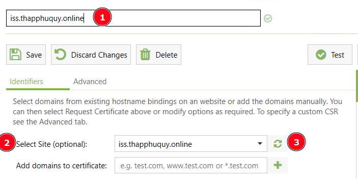
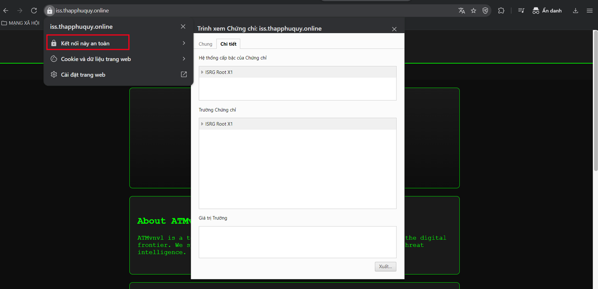

# Cấu hình SSL
## 1. Cài đặt SSL trên IIS Windows


### 1.1 Setup SSL
Vào link sau tải về [Certify The Web](https://certifytheweb.com/)
 
Sau khi cài xong ta mở đến Certify The Web --> New Certificate 


Sẽ xuất hiện hộp thoại như ảnh dưới trong đó:
+ Mục số 1: Điền tên để lưu chứng chỉ SSL
+ Mục số 2: Lựa chọn loại để sử dụng SSL 
+ Mục số 3 nhấn để tạo SSL miễn phí 90 ngày



+ Vì là đang sử dụng trên IIS nên tôi chọn domain là `iss.thapphuquy.online` 


Sau khi tạo xong sẽ như sau:


Để kiểm tra ta nhấn vào `Test`. Báo như ảnh là thành công


### 1.2 Cấu hình HTTPS trên IIS
Vào IIS --> nhấn Sites cần thêm SSL --> Bindings --> nhấn vào Add


Add SSL như ảnh dưới trong đó:
+ Mục số 1 sử dụng HTTPS --> IP address: chọn IP làm web --> Port 443
+ Mục 2 nhập tên web iss.thapphuquy.online
+ Mục 3 lựa chọn SSL ta vừa mới tạo


### 1.3 Cài đặt tự động chuyển hướng từ HTTP sang HTTPS
Nhấn vào HTTP Redirect 


Tick hết các mục ở dưới


### 1.4 Kiểm tra 
Mở trình duyệt và truy cập với link [IIS](https://iss.thapphuquy.online)

Bây giờ website đã kết nối an toàn 



## 2. Cài đặt SSL trên Nginx Ubuntu
### 2.1 Cài đặt Nginx 
Với lệnh sau:
```
sudo apt update
sudo apt install nginx -y
```

### 2.2 Triển khai 
Tạo thư mục chứa website

```
mkdir -p /var/www/nginx.thapphuquy.online
cd /var/www/nginx.thapphuquy.online
vim index.html  //Tạo 1 file index với nội dung bất kỳ
```
### 2.3 Đặt quyền sở hữu và phân quyền
Với lệnh sau:
```
chown -R www-data:www-data /var/www/nginx.thapphuquy.online
chmod -R 755 /var/www/nginx.thapphuquy.online
```
### 2.5 Cấu hình Nginx
Tạo tệp cấu hình trong file với lệnh `vim /etc/nginx/sites-available/nginx.thapphuquy.online` với nội dung như sau:
```
server {
    listen 80;
    listen 443 ssl;

    server_name nginx.thapphuquy.online;

    root /var/www/nginx.thapphuquy.online;
    index index.html;

    ssl_certificate /etc/letsencrypt/live/nginx.thapphuquy.online/fullchain.pem;
    ssl_certificate_key /etc/letsencrypt/live/nginx.thapphuquy.online/privkey.pem;

    location / {
        try_files $uri $uri/ =404;
    }
}

```
Kích hoạt cấu hình với lệnh sau:
```
ln -s /etc/nginx/sites-available/nginx.thapphuquy.online /etc/nginx/sites-enabled/
```
Kiểm tra cấu hình lệnh sau:

```
nginx -t
```
Báo  vậy là thành công 


Khởi động lại Nginx với lệnh sau:
```
sudo systemctl enable nginx
sudo systemctl restart nginx
```


## 3. Cài đặt SSL với Let's Encrypt
### 3.1 Cài đặt Certbot và plugin Nginx
Với lệnh sau:
```
 sudo apt install certbot python3-certbot-nginx -y
 ```
### 3.2 Cấp chứng chỉ SSL
Với lệnh sau:
```
sudo certbot --nginx -d nginx.thapphuquy.online
```
Báo như ảnh dưới là thành công
+ Nhập email của mình
+ Đường dẫn lưu tại  /etc/letsencrypt/live/nginx.thapphuquy.online/


### 4. Kiểm tra
Mở trình duyệt với Link [Nginx](https://nginx.thapphuquy.online). Ta đã tạo thành công 


## 3. Cài đặt SSL trên Apache
### 3.1 Cài đặt Apache và Certbot
Với lệnh sau:
```
sudo apt update
sudo apt install apache2
sudo apt install certbot python3-certbot-apache
```
### 3.2 Cấu hình Apache VirtualHost
Mở đến file `/etc/apache2/sites-available/apache.thapphuquy.online.conf` thêm nội dung như sau:
```
<VirtualHost *:80>
    ServerName apache.thapphuquy.online
    ServerAdmin admin@apache.thapphuquy.online
    DocumentRoot /var/www/apache.thapphuquy.online

    ErrorLog ${APACHE_LOG_DIR}/error.log
    CustomLog ${APACHE_LOG_DIR}/access.log combined
</VirtualHost>
```
Kích hoạt VirtualHost lệnh sau:
```
sudo a2ensite apache.thapphuquy.online.conf
```
Kiểm tra cấu hình:
```
sudo apache2ctl configtest
```
Khởi động lại Apache:
```
sudo systemctl reload apache2
```
### 3.3 Tạo thư mục và nội dung website
Tạo thư mục website và đặt quyền sở hữu:
```
sudo mkdir -p /var/www/apache.thapphuquy.online
sudo chown -R $USER:$USER /var/www/apache.thapphuquy.online
```
Tạo index.html trong `/var/www/apache.thapphuquy.online/index.html` với nội dung bất kỳ 

### 3.4 Cấp chứng chỉ SSL
Dùng Certbot để cấp chứng chỉ SSL:
```
sudo certbot --apache -d apache.thapphuquy.online
```


Kiểm tra với [link sau](https://apache.thapphuquy.online/)
 
 

