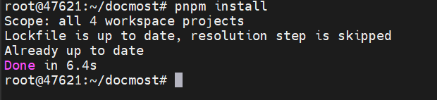
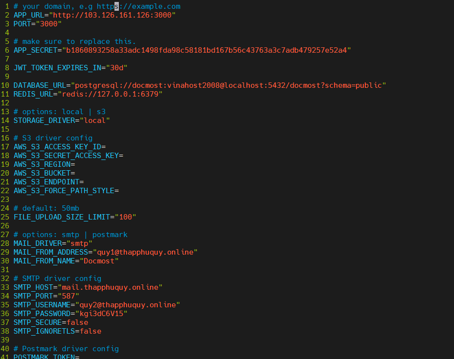
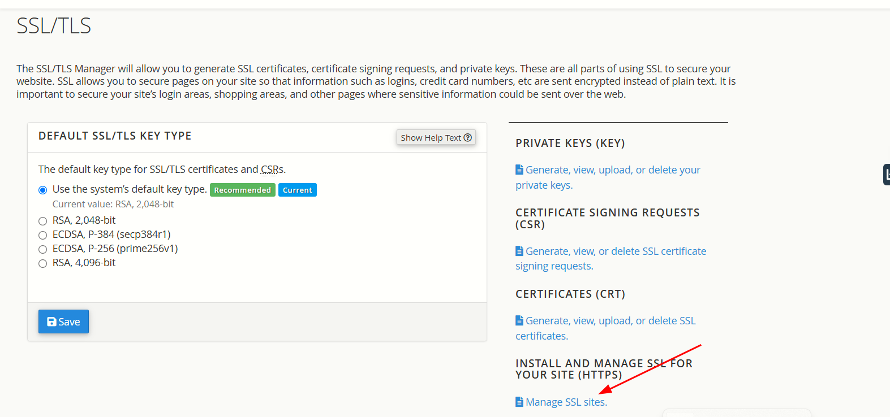

## Docmost:  là một wiki cộng tác và phần mềm tài liệu nguồn mở. Đây là một giải pháp thay thế nguồn mở cho Confluence và Notion.
## Tính năng chính
+ `Hợp tác theo thời gian thực`: Cho phép nhiều người dùng làm việc cùng lúc trên tài liệu.
+ `Biểu đồ`: Hỗ trợ tích hợp các biểu đồ từ Draw.io, Excalidraw và Mermaid
+ `Không gian làm việc`: Tạo và quản lý nhiều không gian làm việc khác nhau.
+ `Quản lý quyền`: Kiểm soát quyền truy cập của người dùng vào các tài liệu và không gian làm việc.
+ `Nhóm`: Tạo và quản lý các nhóm người dùng để dễ dàng cộng tác
+ `Bình luận`: Cho phép người dùng thêm bình luận và phản hồi trên tài liệu.
+ `Lịch sử trang`: Theo dõi và xem lại các phiên bản trước của tài liệu.
+ `Tìm kiếm`: Tìm kiếm nhanh chóng các tài liệu và thông tin cần thiết.
+ `Đính kèm tệp`: Hỗ trợ đính kèm các tệp vào tài liệu.


## Cài đặt Docmost
[Docmost](https://github.com/docmost/docmost)

### 1. Cài đặt các gói 
Tiến hành git clone dự án Docmost về: `https://github.com/docmost/docmost`

Cài đặt gói Nodejs và kiểm tra phiên bản
```
curl -fsSL https://deb.nodesource.com/setup_18.x | sudo -E bash -
apt install -y nodejs
node -v
npm -v
```

Cài đặt Postgresql và kích hoạt 
```
sudo apt update
sudo apt install wget gnupg2 -y
wget -qO - https://www.postgresql.org/media/keys/ACCC4CF8.asc | sudo apt-key add -
echo "deb http://apt.postgresql.org/pub/repos/apt $(lsb_release -cs)-pgdg main" | sudo tee /etc/apt/sources.list.d/pgdg.list
sudo apt update
sudo apt install postgresql-13 -y

systemctl enable postgresql
systemctl restart postgresql
```
Cài đặt Redis và kích hoạt 
```
sudo apt-get install lsb-release curl gpg
curl -fsSL https://packages.redis.io/gpg | sudo gpg --dearmor -o /usr/share/keyrings/redis-archive-keyring.gpg
sudo chmod 644 /usr/share/keyrings/redis-archive-keyring.gpg
echo "deb [signed-by=/usr/share/keyrings/redis-archive-keyring.gpg] https://packages.redis.io/deb $(lsb_release -cs) main" | sudo tee /etc/apt/sources.list.d/redis.list
sudo apt-get update
sudo apt-get install redis

sudo systemctl enable redis-server
sudo systemctl start redis-server
```
### 2. Triển khai 
#### 2.1 Tải trình quản lý gói pnpm 
```
npm install -g pnpm
```
Cài đặt các gói phụ thuộc được liệt kê trong tệp package.json bằng công cụ quản lý gói pnpm
```
pnpm install
```
Sao chép file .env.example thành file .env
```
cp .env.example .env
```


Chạy lệnh openssl để tạo ra một chuỗi ngẫu nhiên có độ dài 32 ký tự. Và khai báo trong file .env phần `APP_SECRET`
```
openssl rand -hex 32
```
Nội dung khai báo file .env. Trong đó:
+ Dòng 1-3: khai báo url và cổng
+ Dòng 5-6: khóa mã hex ngẫu nhiên 
+ Dòng 8: thời gian hết hạn token JWT
+ Dòng 10: địa chỉ kết nối đến postgresql và tài khoản và mật khẩu
+ Dòng 11: địa chỉ kết nối đến redis
+ Dòng 14-22: loại lưu trữ S3 của Amazon,ID, Key
+ Dòng 25: giới hạn kích thước tệp tải lên
+ Dòng 27-38: địa chỉ cấu hình máy chủ thư SMTP 




