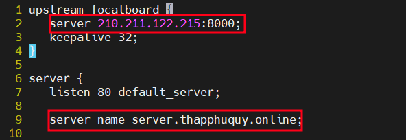
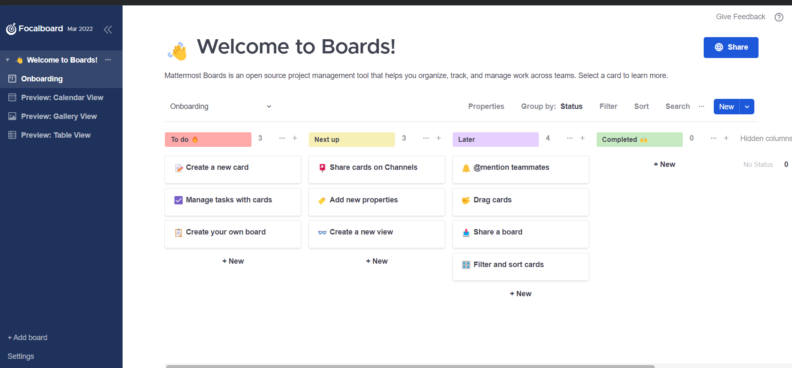

## Focalboard là một công cụ quản lý dự án nguồn mở, đa ngôn ngữ, tự lưu trữ, là một giải pháp thay thế cho Trello, Notion và Asana. Nó giúp định nghĩa, tổ chức, theo dõi và quản lý công việc trên các cá nhân và nhóm. 
[Focalboard](https://github.com/mattermost-community/focalboard)
## I. Các tính năng chính
### 1. Quản lý Nhiệm vụ
+ Tạo, chỉnh sửa và theo dõi nhiệm vụ.

+ Phân loại nhiệm vụ theo trạng thái (chưa bắt đầu, đang thực hiện, đã hoàn thành).
### 2. Bảng Kanban
+ Tạo bảng kanban để quản lý quy trình làm việc.
+ Kéo và thả nhiệm vụ giữa các cột.
### 3. Ghi Chú và Tài Liệu
Ghi chú nhanh và lưu trữ thông tin quan trọng.
Chia sẻ tài liệu với các thành viên trong nhóm.
### 4. Tùy Chỉnh Bảng
+ Tùy chỉnh các bảng công việc theo nhu cầu của người dùng.
+ Thêm các trường tùy chỉnh để theo dõi thông tin cụ thể.
### 5. Giao Diện Thân Thiện
+ Giao diện người dùng trực quan, dễ sử dụng.
+ Tích hợp các tính năng kéo và thả.
### 6. Tích Hợp với Công Cụ Khác
+ Tích hợp với Mattermost và các công cụ khác để tăng cường khả năng hợp tác.
### 7. Báo Cáo và Phân Tích
+ Cung cấp báo cáo về tiến độ và hiệu suất công việc.
+ Theo dõi thời gian và nguồn lực sử dụng cho từng nhiệm vụ.
### 8. Chia Sẻ và Cộng Tác
+ Chia sẻ bảng và nhiệm vụ với các thành viên trong nhóm.
+ Hỗ trợ cộng tác thời gian thực

## II. Cài đặt

### 1. Tải gói Focalboard

Tải gói lưu trữ trên github và giải nén di chuyển đến /opt
```
apt update -y
wget https://github.com/mattermost/focalboard/releases/download/v0.15.0/focalboard-server-linux-amd64.tar.gz
tar -xvzf focalboard-server-linux-amd64.tar.gz
sudo mv focalboard /opt
```

### 2. Cài đặt Nginx

```
apt update -y && apt install nginx -y 
```
Tạo trang mới về focalboard `vim /etc/nginx/sites-available/focalboard`
```upstream focalboard {
   server 210.211.122.215:8000;
   keepalive 32;
}

server {
   listen 80 default_server;

   server_name server.thapphuquy.online;

   location ~ /ws/* {
       proxy_set_header Upgrade $http_upgrade;
       proxy_set_header Connection "upgrade";
       client_max_body_size 50M;
       proxy_set_header Host $http_host;
       proxy_set_header X-Real-IP $remote_addr;
       proxy_set_header X-Forwarded-For $proxy_add_x_forwarded_for;
       proxy_set_header X-Forwarded-Proto $scheme;
       proxy_set_header X-Frame-Options SAMEORIGIN;
       proxy_buffers 256 16k;
       proxy_buffer_size 16k;
       client_body_timeout 60;
       send_timeout 300;
       lingering_timeout 5;
       proxy_connect_timeout 1d;
       proxy_send_timeout 1d;
       proxy_read_timeout 1d;
       proxy_pass http://focalboard;
   }

   location / {
       client_max_body_size 50M;
       proxy_set_header Connection "";
       proxy_set_header Host $http_host;
       proxy_set_header X-Real-IP $remote_addr;
       proxy_set_header X-Forwarded-For $proxy_add_x_forwarded_for;
       proxy_set_header X-Forwarded-Proto $scheme;
       proxy_set_header X-Frame-Options SAMEORIGIN;
       proxy_buffers 256 16k;
       proxy_buffer_size 16k;
       proxy_read_timeout 600s;
       proxy_cache_revalidate on;
       proxy_cache_min_uses 2;
       proxy_cache_use_stale timeout;
       proxy_cache_lock on;
       proxy_http_version 1.1;
       proxy_pass http://focalboard;
   }
}

```

Dòng 2 và dòng 9 đổi thành IP và tên miền



Xóa file mặc định của của nginx để thêm focalboard 

```
sudo rm /etc/nginx/sites-enabled/default
```


