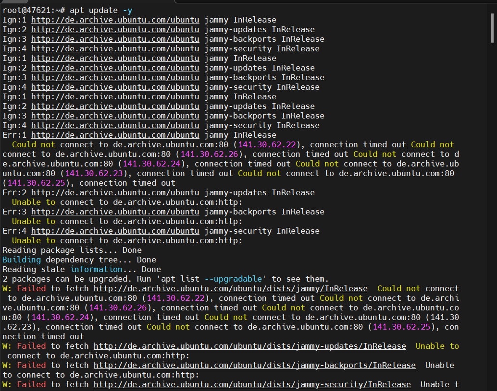
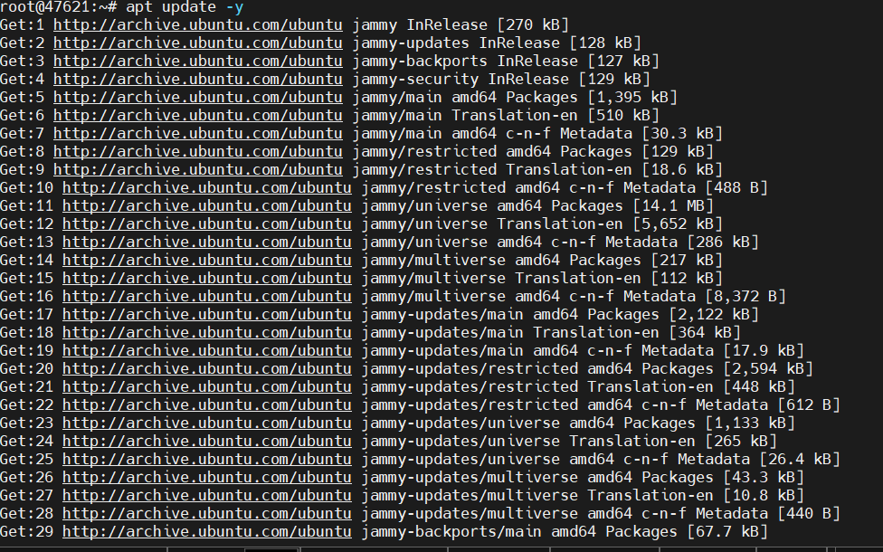
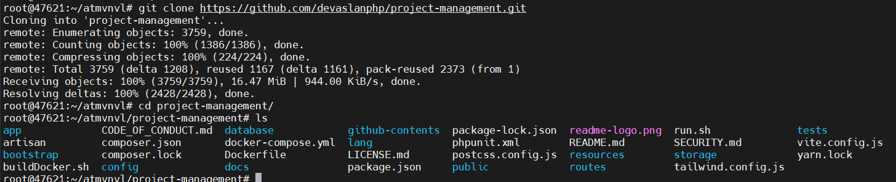

 |# Web App Helper là một công cụ quản lý các dự án của mình 
## Các tính năng chính
| Các tính năng             | Miêu tả | 
| :------------             | :------ | 
| Permissions  | Cấp quyền cụ thể từng người dùng khi tạo  |
| Roles           | Thêm các vai trò cần thiết cho người dùng |
| Project - Ticket          | Hỗ trợ theo dõi dễ dàng  | 
| Language | Hỗ trợ nhiều ngôn ngữ | 
|Login | Hỗ trợ nhiều loại xác thực OIDC, Google, Facebook| 

## So sánh Leantime với Helper
| Phân loại | Helper | Leantime| 
| :-------- | -------- | ------ |
| Chung | Đều mã nguồn mở, quản lý các dự án, triển khai dễ dàng với công nghệ Docker, hỗ trợ nhiều ngôn ngữ | 
| Nền tảng  | Laravel, TailwindCSS, Filament, PHP 8 | PHP, Vue.js, Bulma CSS |
| Xác thực	| OAuth, OpenID Connect | Không hỗ trợ OAuth mặc định | 
| Quản lý dự án	| Tickets, thời gian thực, bảng Kanban | Bảng Kanban, Scrum, Roadmap, OKR |
| Đối tượng người dùng | Nhóm phát triển phần mềm nhỏ | Doanh nghiệp vừa và nhỏ, startup | 
| Chức năng theo thời gian thực | Pusher tích hợp | Không có mặc định |

## [Documents](https://devaslanphp.github.io/project-management/#/installation?id=installing-the-project)

## [Github](https://github.com/devaslanphp/project-management)

### Fix lỗi không update được 

### Đổi source với lệnh sau: `sudo sed -i 's|http://de.archive.ubuntu.com|http://archive.ubuntu.com|g' /etc/apt/sources.list`

Kết quả: 

### Tiến hành git clone về với lệnh sau: `git clone https://github.com/devaslanphp/project-management && cd project-management`

### Tiến hành cài `docker.io và docker-compose`

### Tiến hành Build image locally lệnh sau: `docker build --network=host -t vina/helper:latest .`  (khá lâu )

### Lệnh để xây dựng vùng chứa docker: `docker-compose up -d` (khá lâu)

### Kiểm tra các docker container đã build: `docker ps -a` 

### Tiến hành login url: `http://103.153.254.29:8000/login`

### Khi login báo như sau: chưa có database về user tiến hành tạo 

### Tiến hành thực hiện lệnh trong một container đang chạy bằng lệnh sau: `docker exec -it helper-server /bin/bash`

### Tiến hành update container và cài đặt vim

### Chạy lệnh `npm audit fix` nếu có lỗi khi dùng lệnh npm install 

### Tạo khóa ứng dụng lệnh sau: ` php artisan key:generate` (có thể bỏ qua)

### Tạo cơ sở dữ liệu: `php artisan migrate`

### Tạo cơ sở dữ liệu để chèn người dùng mặc định thông tin tham chiếu và quyền lệnh sau: `php artisan db:seed`

### Triến khai dự án vào hoạt động: ` npm run build`

### Tiến hành đăng nhập lại url: `http://103.153.254.29:8000/`
+ Login: user:pass: `john.doe@helper.app:Passw@rd`

### Bảng tổng quan về Helper 

### Tiến hành tạo thêm user lệnh sau: `php artisan tinker`

### Tiến hành login với user và pass mới tạo (`secroot1112@gmail.com` và `vinahost`)

### Hệ thống bắt xác thực Email 

### Ta có bỏ qua xác thực mail chỉnh sửa trong file sau: `vim app/Models/User.php`
+ Dòng 9 và 23 comment 
+ Dòng 24 thêm như sau: `class User extends Authenticatable implements FilamentUser`

### Tiến hành đăng nhập lại và ta thành công với bảng Dashboard với user `secroot1112@gmail.com`

### Tạo tài khoản user trên web 

### Qua bảng Dashboard của Admin vào User kiểm tra các user trên hệ thống

### Tạo dự án và thêm các ngươi dùng 

Tạo `Project statuses` rồi nhấn Create

Tạo `Projects`  rồi nhấn Create 

Thêm user vào trong Project --> cuộn xuống dưới User --> Attach --> thêm các user vào dự án --> Attach

Kết quả:

Kiểm tra tài khoản của người dùng 

### Thêm các quyền vai trò cho người dùng 

Thêm vai trò vào mục `Permission --> Roles --> New role --> Nhập Permission name --> Add các quyền cần thiết --> Create`

Kết quả đã tạo thành công với roles tên là `Guest`

Thêm các quyền vào người dùng vào mục `Permission --> Users --> Chọn user cần thêm role -->  Edit --> Tick Permission roles chọn Guest --> Save changes`

Kết quả client với email secroot1112@gmail.com đã thêm thành công vào roles vừa mới tạo là Guest

Kiểm tra quyền trên máy khách về ticket 

Vào Board --> Chọn Project Thử Nghiệm 

### Vào Test để thử các chức năng 
Bảng tổng quan Tickets

Mục `Comments`

Kết quả:

Mục `Activities`

Mục `Time logged`

Mục `Attachments`

Kết quả:

