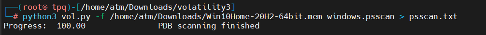
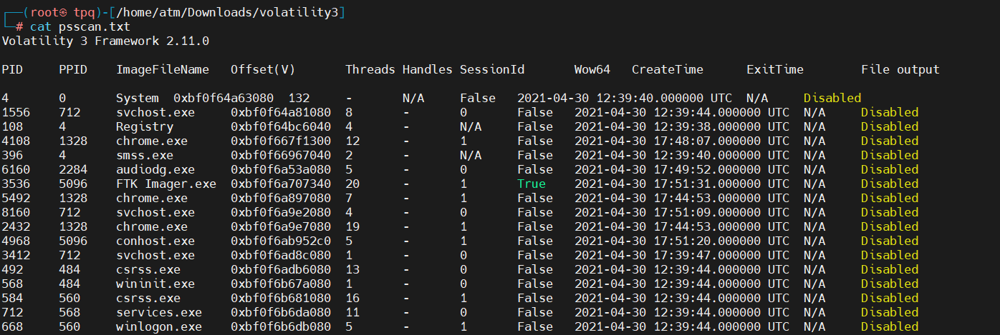
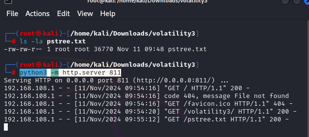

## Câu 1: Giá trị băm (hash) SHA256 của tập tin RAM Dump là gì?
Dùng 7zip check sum 

### 
 Kết quả: 9db01b1e7b19a3b2113bfb65e860fffd7a1630bdf2b18613d206ebf2aa0ea172

### Câu2: Thời gian mà tập tin RAM Dump được thu thập theo hệ thống là khi nào?  
Dùng vol với lệnh sau: `python3 vol.py -f /home/atm/Downloads/Win10Home-20H2-64bit.mem windows.info`

### 
 Kết quả: SystemTime	2021-04-30 17:52:19+00:00 

## Câu 3: Xác định PID của tiến trình "brave.exe" trong tập tin RAM Dump phía trên ?
Dùng vol với lệnh sau: `python3 vol.py -f /home/atm/Downloads/Win10Home-20H2-64bit.mem windows.psscan > psscan.txt`

### 
 Kết quả: 4856 

## Câu 4: Có bao nhiêu kết nối mạng đã được thiết lập tại thời điểm thu thập tập tin RAM Dump? (chỉ điền số)  
Dùng vol và lưu và file `netscan.txt`với lệnh sau: `python3 vol.py -f /home/atm/Downloads/Win10Home-20H2-64bit.mem windows.netscan > netscan.txt `

Tìm kiếm trong file `netscan.txt`đến kết nối thành công và đếm số dòng lệnh sau: `cat netscan.txt | grep -i ESTABLISHED | wc -l`

### 
 Kết quả: 10

## Câu 5: Chrome có kết nối mạng đã thiết lập với tên miền FQDN nào? 
Dùng vol để tìm kiếm các tiến trình về chrome và có 1 kết nối thành công với `IP 185.70.41.130` với lệnh sau: `python3 vol.py -f /home/atm/Downloads/Win10Home-20H2-64bit.mem windows.netscan | grep -i "chrome"`

Dùng nslookup để tra cứu DNS và thấy được `130.41.70.185.in-addr.arpa` để ánh xạ một địa chỉ IP thành một tên miền `protonmail.ch`

### 
 Kết quả: protonmail.ch

## Câu 6: Giá trị băm MD5 của file thực thi có PID 6988 là gì?
Dùng vol với `windows.pslist` để xem các tiến trình PID chi tiết và `--dump` để trích xuất dữ liệu bộ nhớ của PID 6988 lưu lại chúng lệnh: `python3 vol.py -f /home/atm/Downloads/Win10Home-20H2-64bit.mem windows.pslist --pid 6988 --dump `

Dùng md5 để kiểm tra hash file đã dump trên với lệnh sau: `md5sum 6988.OneDrive.exe.0x1c0000.dmp`

### 
 Kết quả: 0b493d8e26f03ccd2060e0be85f430af

## Câu 7: Từ bắt đầu tại offset 0x45BE876 có độ dài 6 byte là gì? 
Dùng tool Hex Workshop --> tìm kiếm với `0x45BE876` đề cho và ta thấy giá trị bắt đầu là từ `hacker`

### 
 Kết quả: hacker

## Câu 8: Ngày và giờ tạo của tiến trình cha của "powershell.exe" là gì?
Dùng vol với `pstree` để xem các tiến trình tra PPID và xuất kết quả ra file `pstree.txt` với lệnh sau: `python3 vol.py -f Win10Home-20H2-64bit.mem windows.pstree > pstree.txt `

Dùng python3 làm dịch vụ http để tổng quan hơn với lệnh sau: `python3 -m http.server 811`

Trên URL IP máy chạy http: `192.168.108.195:811` 

### 
 Kết quả: 2021-04-30 17:39:48 

## Câu 9: Đường dẫn đầy đủ và tên của tệp cuối cùng được mở trong notepad là gì?
Dùng vol `cmdline` trích xuất và hiển thị các dòng lệnh được sử dụng để khởi chạy các tiến trình đang chạy và lưu file với tên `cmdline.txt` lệnh sau: `python3 vol.py -f /home/atm/Downloads/Win10Home-20H2-64bit.mem windows.cmdline > cmdline.txt`

Dùng dịch vụ http python như trên 

### 
 Kết quả: C:\Users\JOHNDO~1\AppData\Local\Temp\7zO4FB31F24\accountNum 

## Câu 10: Nghi phạm đã sử dụng trình duyệt Brave trong bao lâu?
Dùng vol với `registry` để trích xuất thông tin UserAssist từ file RAM dump, plugin này giúp liệt kê các ứng dụng đã mở gần đây, dựa trên thông tin từ registry và lưu lại file `registry.txt`
với lệnh sau: `python3 vol.py -f /home/atm/Downloads/Win10Home-20H2-64bit.mem windows.registry.userassist | grep Brave  > registry.txt `

Chạy dịch vụ http và tìm kiếm đến brave 

### 
 Kết quả: 4:01:54 

