## Taiga một công cụ quản lý dự án mã nguồn mở, được thiết kế để hỗ trợ các nhóm phát triển phần mềm trong việc lập kế hoạch, theo dõi tiến độ và quản lý công việc


## 1. Chức Năng Chính
+ Quản Lý Công Việc: Taiga cho phép người dùng tạo và theo dõi các công việc (task), phân chia nhiệm vụ cho các thành viên trong nhóm.
+ Kanban Board: Cung cấp giao diện trực quan để quản lý quy trình làm việc, giúp nhóm dễ dàng theo dõi tiến độ.
+ Quản Lý Dự Án: Hỗ trợ lập kế hoạch dự án, phân chia thời gian và tài nguyên.
+ Báo Cáo và Phân Tích: Cung cấp các báo cáo chi tiết về tiến độ và hiệu suất của dự án.

## 2. Xây dựng dự án Taiga
### 2.1 Docker
Cài đặt các gói docker và docker-compose 
```
apt update -y
apt install docker.io -y
apt install docker-compose -y 
```
Khởi động docker và kích hoạt cùng hệ thống
```
systemctl enable docker
systemctl restart docker 
```
### 2.2 Git clone 
Git clone dự án về
```
git clone git@github.com:taigaio/taiga-docker.git
cd taiga-docker
git checkout stable
```
### 2.3 Cấu hình file .env 
Mở và cấu hình file `.env` như sau:
+ Dòng 1-5: cấu hình url taiga
+ Dòng 9: khóa bí mật chạy lệnh `openssl rand -hex 32`
+ Dòng 11-13: cấu hình cơ sở dữ liệu 
+ Dòng 15-24: cấu hình cài đặt SMTP
+ Dòng 26-30: cấu hình cài đặt RabbitMQ lệnh `opensll rand -hex 16`
+ Dòng 32-33: cấu hình tệp đính kèm 
+ Dòng 35-36: cài đặt Telemetry tính năng thu thập thông tin ẩn danh từ người dùng

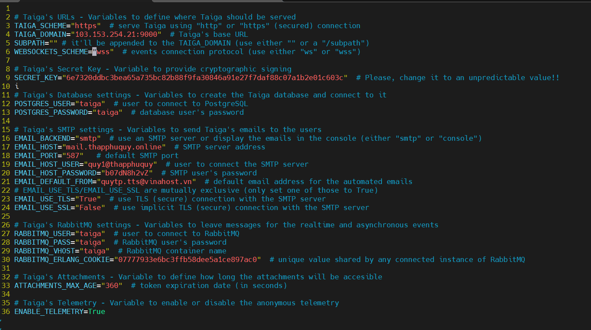

### 2.4 Triển khai 
Khởi chạy dịch vụ taiga
```
./launch-all.sh
````

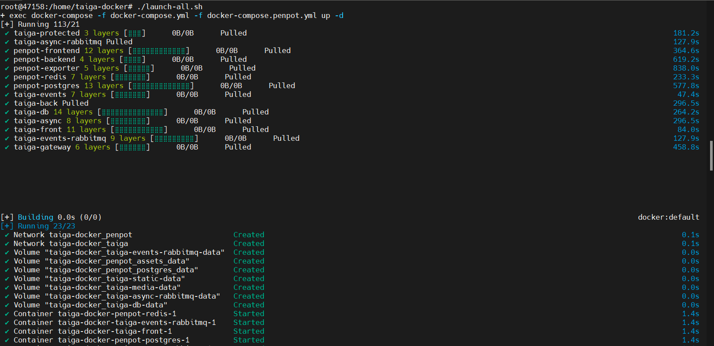

Tạo người dùng quản trị với:
+ Username: root
+ Email address: quytp.tts@vinahost.vn
+ Password: Admin1234@
```
./taiga-manage.sh createsuperuser
```

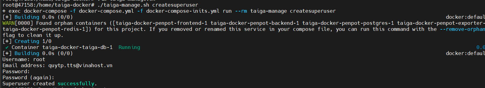

Xử lý nếu có lỗi 
+ Với file có `.sh` Có thể phiên bản đang dùng Docker không hỗ trợ cú pháp `docker compose` mà cần sử dụng `docker-compose` và chạy lệnh 

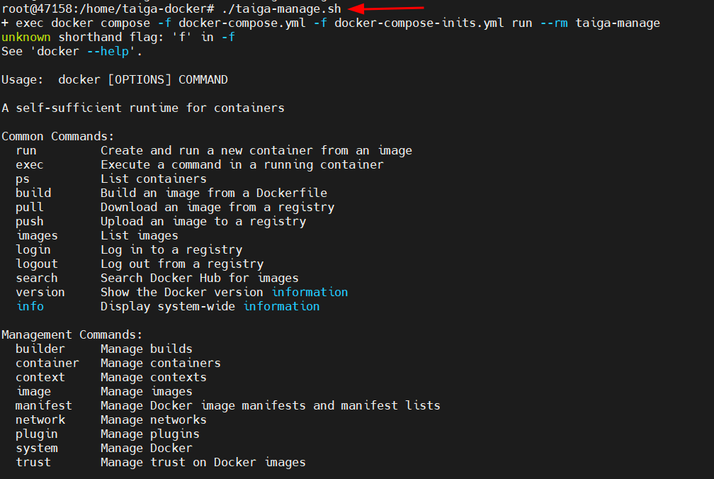

### 2.5 Đăng nhập
Mở trình duyệt vào link: `http://103.153.254.21:9000`

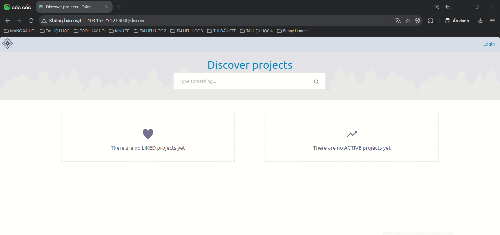

Nhấn vào login và điền thông tin ta đã khai báo trên

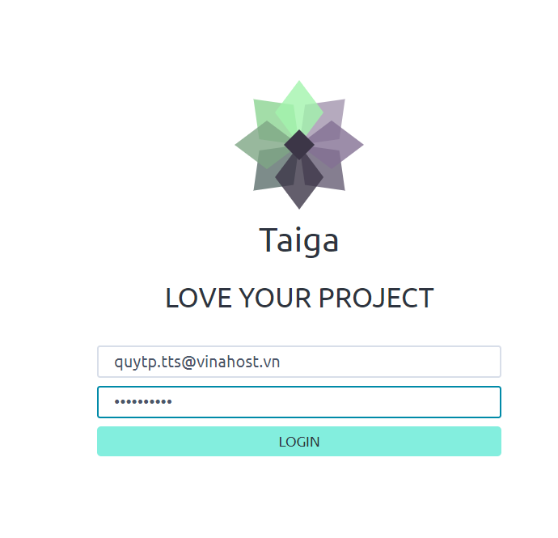

Tiến hành tạo dự án 
Nhấn vào New Project --> tick vào các ô --> Create Project chọn mẫu --> New project details tạo tên, mô tả và lựa chọn chế độ riêng tư hay công khai --> Create 

Sau khi tạo xong 

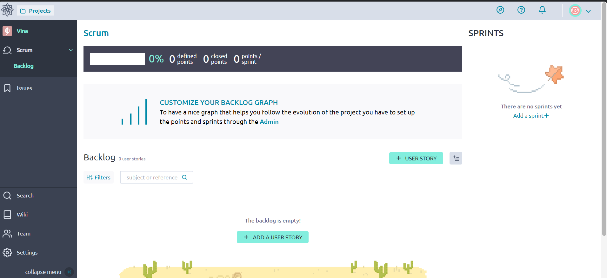

Tiến hành thêm người dùng vào Setting --> Members --> Manage members --> New members --> Nhập email cần thêm 

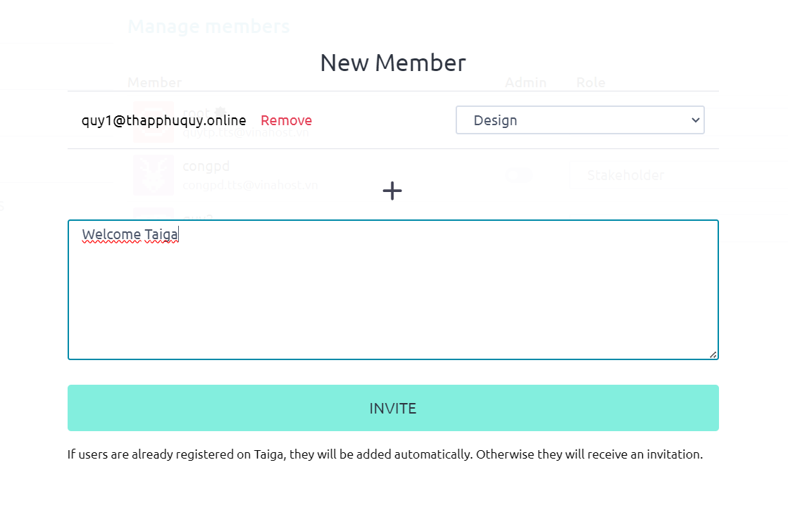

Sau khi thêm các người dùng

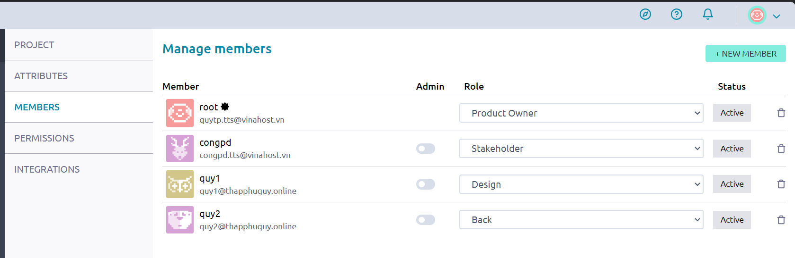

Tạo các mô-đun Taiga Kanban 

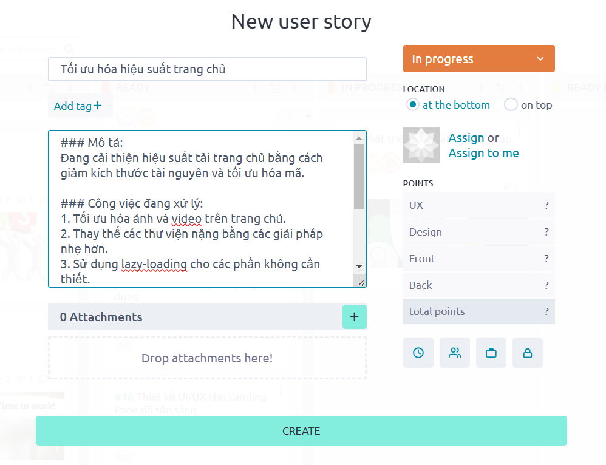

Kết quả sau khi tạo các xong --> nhấn Expanded để xem chế độ mở rộng

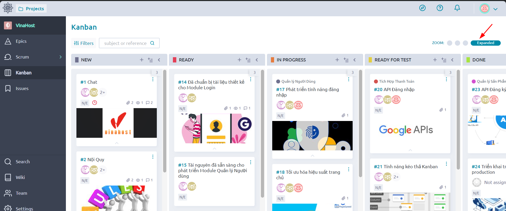

Tạo các Epics 

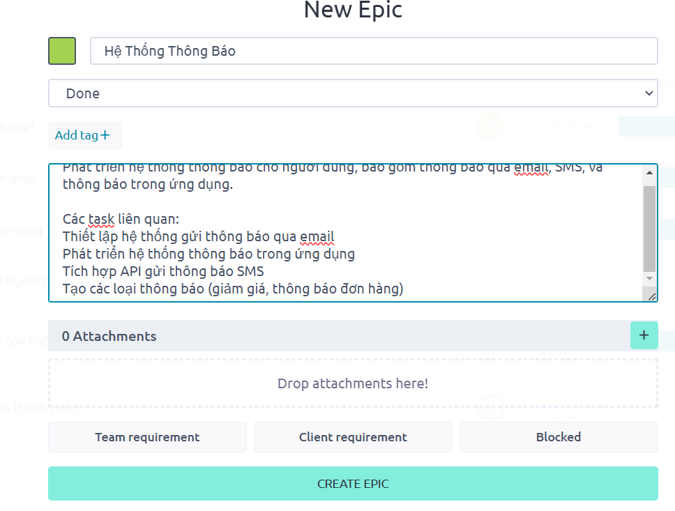

Kết quả tạo xong Epics

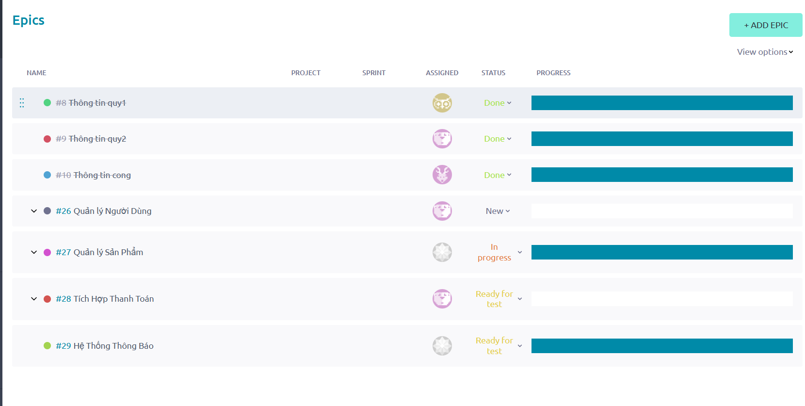

Tạo các Issues 

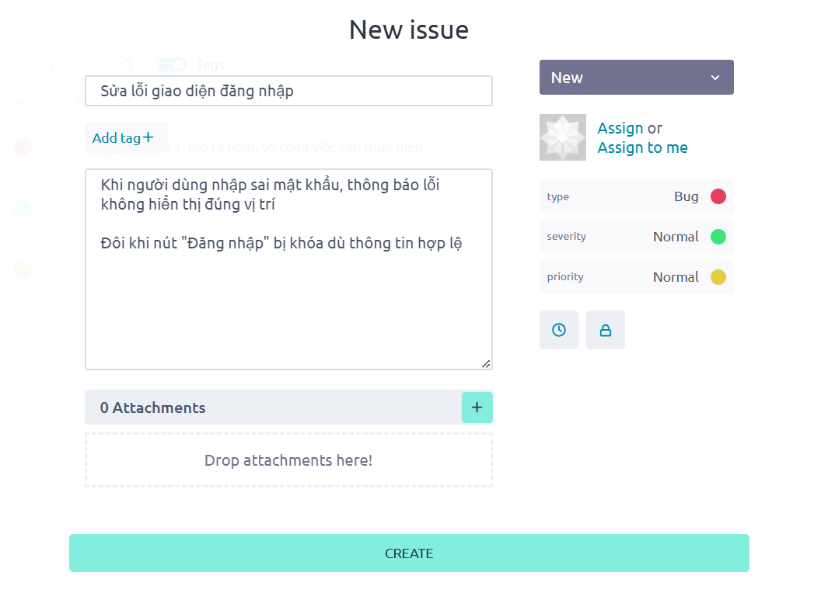

Kết quả tạo xong Issues

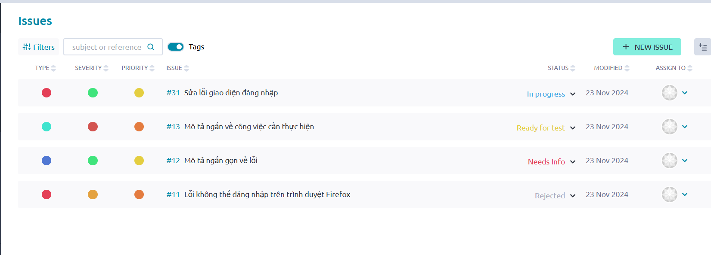

Tạo các Wiki

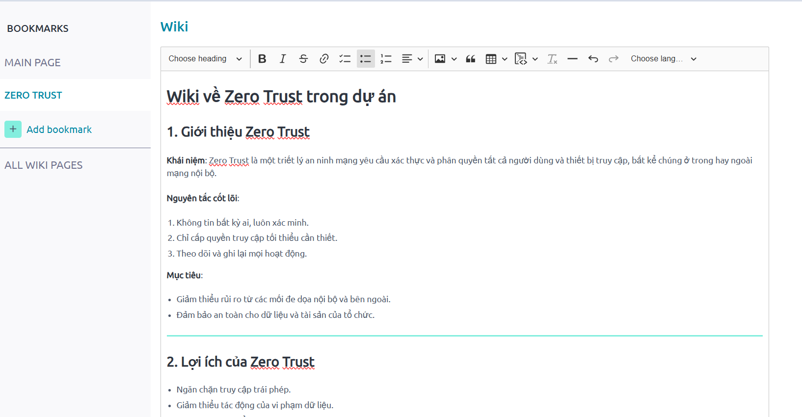

## 2.6 Cấu hình Webhooks trong github
Vào user root setting --> attributes --> github

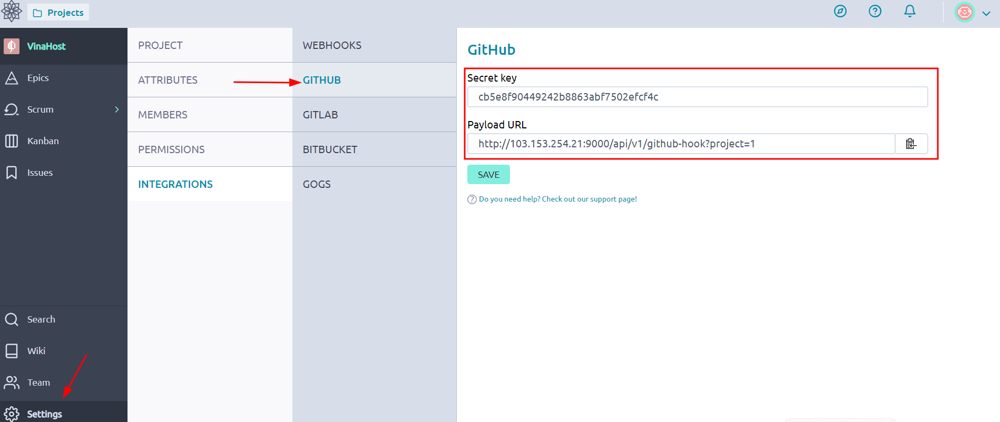

Vào user cần lưu kho lưu trữ trên github copy và dán `secret key và payload URL`

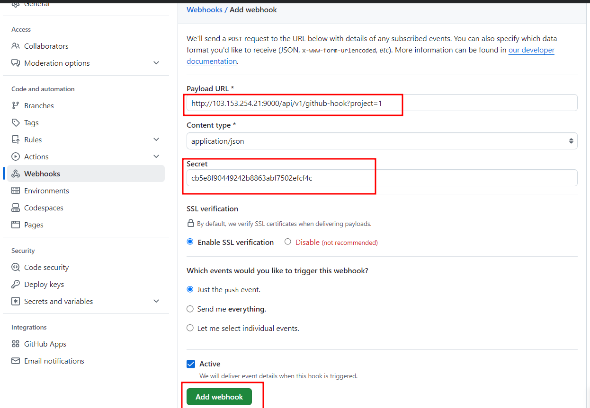

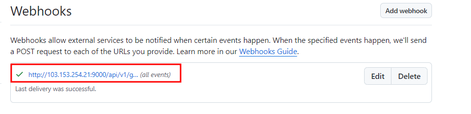


