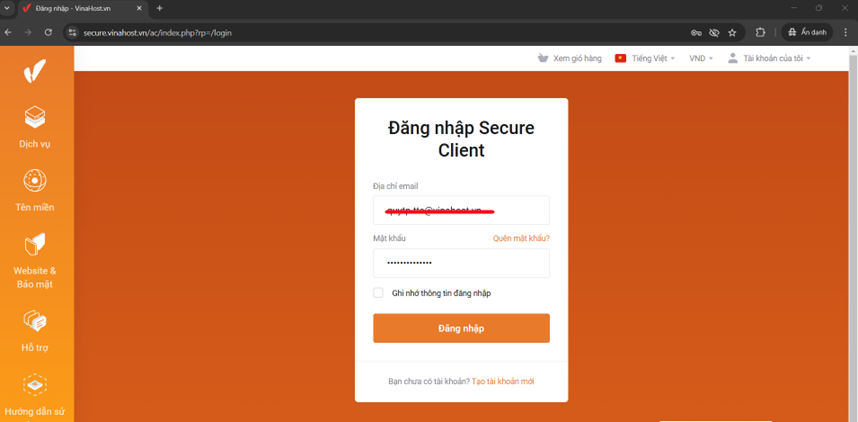
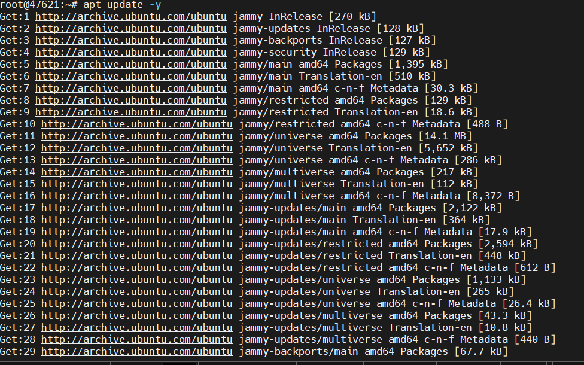
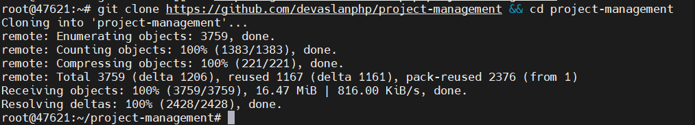
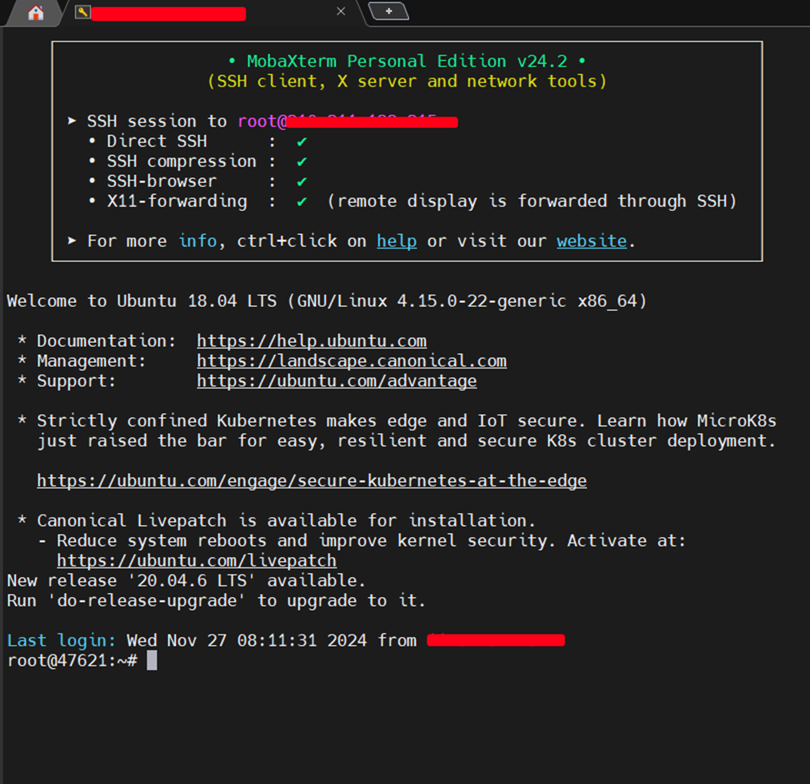

## HƯỚNG DẪN CÁCH SỬ DỤNG TRANG VINAHOST KHỞI ĐỘNG DỊCH VỤ VPS

### Bước 1: Vào trang https://secure.vinahost.vn/ac/index.php?rp=/login  

--->  Nhập tài khoản quản trị đăng ký 
dịch vụ bên vinahost.vn để đăng nhập như hình  
 + Nếu không nhớ mật khẩu nhấn quên mật khẩu rồi đặt lại 
 
 + Chưa có tài khoản nhấn tạo tài khoản mới 
 
 

### Bước 2: Tiến hành quản lý các dịch vụ của tôi 
Bảng tổng quan ---> chọn VPS cần khởi động và nhấn quản lý như trong hình 
 
 
 Sau khi nhấn `Quản lý` ta vào được chi tiết loại dịch vụ đó 

#### Cách 1: 
Trong phần Thao tác ta có các lựa chọn sau: 
 + Start VPS
 + Reboot VPS
 + Stop VPS
 + Poweroff VPS
 + Nâng cấp / Hạ cấp
 +  Tùy chọn nâng cấp / hạ cấp
  
#### Cách 2: 
Kéo xuống dưới cùng có bảng tổng quan hiển thị về dung lượng, CPU, băng thông, tốc độ mạng, tài khoản, ...

Ta nhấn vào restart VPS ---> báo thành công là đúng

Trong đó có các thao tác như:
 + Poweroff  the VPS
 + Restart the VPS 
 + Connect VNC

### Bước 3: Kiểm tra kết nối

Chúc Quý khách thành công

